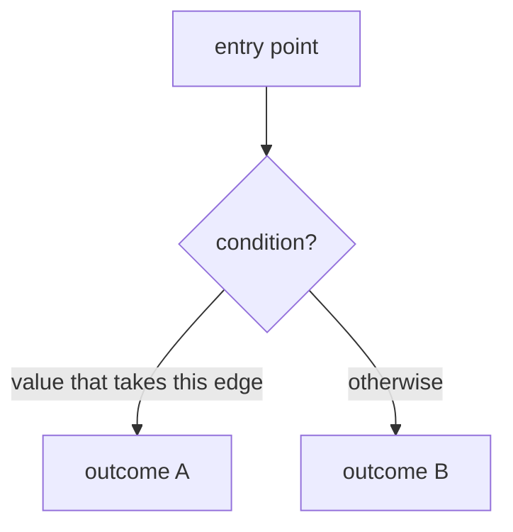
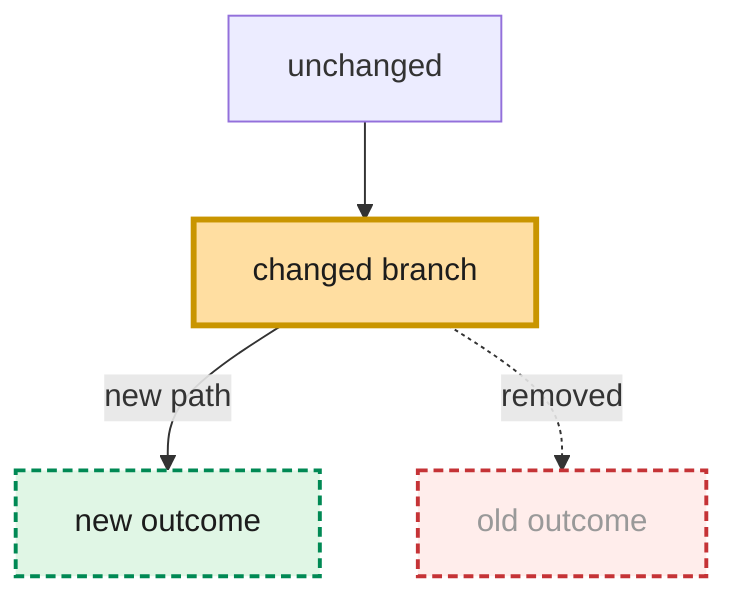
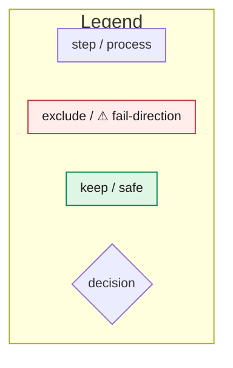
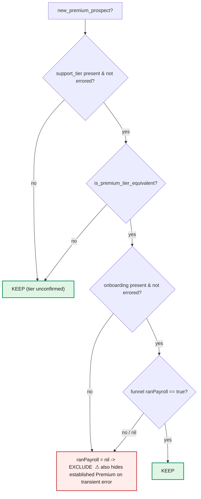

# Mermaid conventions for control-flow charts

These conventions exist so the chart answers the question the user actually has — *"what
happens to this input, and where does it go wrong?"* — not just "what are the boxes."

## Skeleton

Use `flowchart TD` (top-down). Quote node labels in `["..."]` (rectangles) and `{"..."}`
(decisions) so punctuation is safe. **Avoid raw `<`, `>`, `&` in labels** — write words
("Array of Hash") or rely on the preview script's HTML-escaping; raw angle brackets can
confuse rendering on some surfaces.



## Decision-level chart (default; "zoom in")

One method / predicate, every branch traced. Rules:
- Each decision node states the **real condition** from the code (e.g. `support_tier present & not errored?`).
- Each edge is labeled with the **value** that takes it (`yes` / `no` / `nil` / `true`).
- **Terminal nodes are the actual outcomes** in the domain's vocabulary (KEEP / EXCLUDE,
  not `return true`).

## System-level chart ("zoom out")

The call path across methods: caller → service → sub-steps → response. Nodes are
methods/stages and their hand-offs (what type/shape flows along each edge). Do **not** expand
line-level branch logic here — that's what zooming in is for.

## Fail-direction annotations (the high-value part)

For every branch, make the nil / error / missing-data path explicit as its own node — these
are where comprehension breaks. Flag with ⚠ any node that **conflates "unknown" with a real
value** (e.g. an errored fetch falling back to `nil` and being treated as "didn't happen").
That annotation is usually the whole reason the chart is worth drawing.

## Before / after pairs

For refactors / behavior changes, two fenced blocks, each with a one-line heading:

> **Before — <one-line summary>**
> ```mermaid ... ```
> **After — <one-line summary>**
> ```mermaid ... ```

Keep node **IDs stable** across the pair so position holds and the eye tracks what moved.

## Making changes obvious (don't make the reader diff)

Whenever a chart represents a change — before/after, current→proposed, or a refinement of a
prior version — the delta must be *visually obvious*, not something the reader hunts for.

1. **Lead with a one-line caption** above the chart (or the pair): `**What changed:** …`.
2. **Mark the delta with these reusable classes** (define once per diagram, apply with `:::`):



- **added** — green, dashed border (new node/edge).
- **removed** — red, dashed border, muted text (gone in the "after"; show it so the loss is visible).
- **changed** — amber, thick border (same node, different behavior/condition).
3. **Leave everything else in the default style** so the highlighted nodes pop. If three-quarters of
   the chart is colored, the highlight means nothing — only the delta gets a change class.
4. For a **before/after pair**, the *after* chart carries the highlights; the *before* is the plain
   baseline. For a **single refinement**, highlight what moved versus the version it replaces.

## Styling palette

Keep it consistent so colors carry meaning. **One color = one meaning** — never reuse a hue
for two ideas, or the chart stops being legible (this was the original sin: amber meant both
"decision" and "changed").
Palette: **Gusto Workbench tokens** (source: `web/libs/workbench/tokens/tokens/color/palette.json`).
Color names below are the *role*; the shades are real Workbench semantic palettes (light fill / dark stroke).
- **red / strawberry** — exclude / suppress / risky / ⚠ fail-direction · `fill:#ffedeb,stroke:#c53336`
- **green / asparagus** — keep / safe / happy path · `fill:#e0f6e5,stroke:#008954`
- **blue / cornflower** — a returned struct / result / hand-off · `fill:#ebf1ff,stroke:#006cc1`
- **amber / ginger** — **changed behavior** only (the `changed` class; see "Making changes obvious").
  Reserved for deltas · `fill:#ffdea1,stroke:#c99500`

**Shape carries "is a decision," not a *role* color.** A decision is already a diamond (`{"..."}`);
never give it red/green/blue/amber — those are reserved for outcome and delta. Decisions (and plain
steps) stay **neutral salt**; the preview gives diamonds a prominent **2px** border
(`fill:#fafafa,stroke:#9f9f9f`, text salt.1900 `#1c1c1c`) so they read as peers of the colored outcome
boxes while staying uncolored — **color marks the *outcome*, shape marks the *question*.** Neutral is
deliberate: ginger already owns "changed," so a colored decision would re-create the very collision we
removed. Brand **kale** (`#0a8080`) is a non-semantic accent (headings), never a node color.

Diamonds are **sharp-cornered** by design: CSS can't round a polygon's fill (only a `<rect>` has `rx`),
and the sharp-diamond-vs-rounded-rectangle contrast is exactly what distinguishes a *branch* from a
*step*. The preview only softens the stroke joins (`stroke-linejoin:round`).

**Type:** GCentra (Workbench `type.family`) with system fallbacks, set in the preview's `themeVariables`:
`"GCentra", -apple-system, BlinkMacSystemFont, "Segoe UI", "Roboto", Helvetica, Arial, sans-serif`. It
renders if GCentra is installed locally and falls back gracefully otherwise; GitHub/Notion pick their own
font regardless (preview-only luxury).

```mermaid
style RiskNode fill:#ffedeb,stroke:#c53336,stroke-width:2px,color:#1c1c1c
```

## Legend (optional — off by default)

The palette is **consistent across every chart** and documented right here, so a reader learns the
vocabulary once and it holds everywhere — repeating a key on each chart is redundant. With the intuitive
Workbench colors (red=exclude, green=keep, blue=struct, amber=changed) plus the diamond=decision shape,
charts are self-evident, so **default to no legend**.

**Legend PRN — rule of thumb:**
- **No legend** for the self-evident vocabulary: neutral *step* rectangles, green *success/keep*, red
  *fail/exclude*, and the neutral *decision* diamond — a reader decodes those on sight.
- **Add a legend** when the chart goes beyond that: the **change classes** (added / removed / changed),
  a **kale path-highlight**, **blue struct/result** nodes, custom shapes, **dotted/secondary edges** —
  i.e. before/after and other complex charts — or when sharing cold.
- **An edge *style* is an encoding too.** **Prefer solid edges** — let the edge *label* carry the nuance
  (e.g. "pipeline error, strategy already set"). Use a dotted edge (`-.->`) only when a secondary /
  fall-through distinction is genuinely load-bearing, and then **key it** with a dotted swatch in the
  legend (`A -.-> B` labeled e.g. "secondary / fall-through"). Never leave an unexplained line style — and
  note a dotted *edge* ≠ a dashed *node border* (which means "added").

When you include one:

- **Own fence, scoped spacing.** Give the legend its own ` ```mermaid ` fence with a `%%{init}%%` so its
  gaps are independent of the flow (a legend embedded in the flow is stuck sharing the flow's `rankSpacing`).
- **Scope it to what the chart uses** — only the colors/shapes actually present; a full-palette key is noise.
- **One swatch per meaning**, styled like the real nodes. Vertical stack via `direction TB` + invisible
  links (`A ~~~ B ~~~ C`); shrink with `classDef lg font-size:11px;`.



## Highlighting a path to follow (complex charts)

For a chart with many branches, draw the eye along the one flow the reader should trace by coloring its
edges **kale** (`#0a8080` — the brand accent; edges are otherwise neutral, so no collision) and thicker —
e.g. `linkStyle 3,5,7 stroke:#0a8080,stroke-width:3.5px`.

`linkStyle` targets edges by **index** (0-based, in order of definition), so count the edges along the
path. **Drawing to explain vs explore:** if the chart exists to make a point (a bug, a fix's route, where
it breaks), trace *that* path automatically — the author knows it because the path *is* the thesis. Only
ask which flow to trace when the chart is exploratory. It's plain `.md`, so the highlight travels to
GitHub/Notion. A chart with a path-highlight should carry a legend (above) with a kale "path to follow" swatch.

## Worked example (decision-level, with fail-direction ⚠)

`new_premium_prospect?` — Premium + no-first-payroll → exclude; note the nil conflation:



(No legend — the palette is consistent and documented above. Decision diamonds render neutral salt with
a prominent border via the preview theme; the colored terminals carry the meaning.)

## Preview rendering

The preview (`scripts/render_preview.py` → `templates/preview.html`) themes the chart with **Workbench
tokens + GCentra**, wraps it in a single centered card, and exposes a size knob:
- **`CHART_SCALE`** (in `preview.html`) — overall size, scaling the whole SVG via its **viewBox**
  (uniform, no text clipping). `fontSize` is the in-chart text base; displayed size ≈ `fontSize × CHART_SCALE`.
- Render **waits for GCentra to load before drawing** (`document.fonts.load` → `mermaid.run()`), so node
  boxes are measured with the real font and text never clips. **Do not use CSS `zoom`** to resize — it
  reflows the htmlLabel `foreignObject`s and clips the text.

The preview loads `mermaid` from a CDN (needs internet). Styling lives in the preview, so it travels as a
**screenshot** (the chosen workflow), *not* via the raw ` ```mermaid ` source — a GitHub/Notion render of
the `.md` uses their default theme. The saved `.md` is the editable source of truth.
