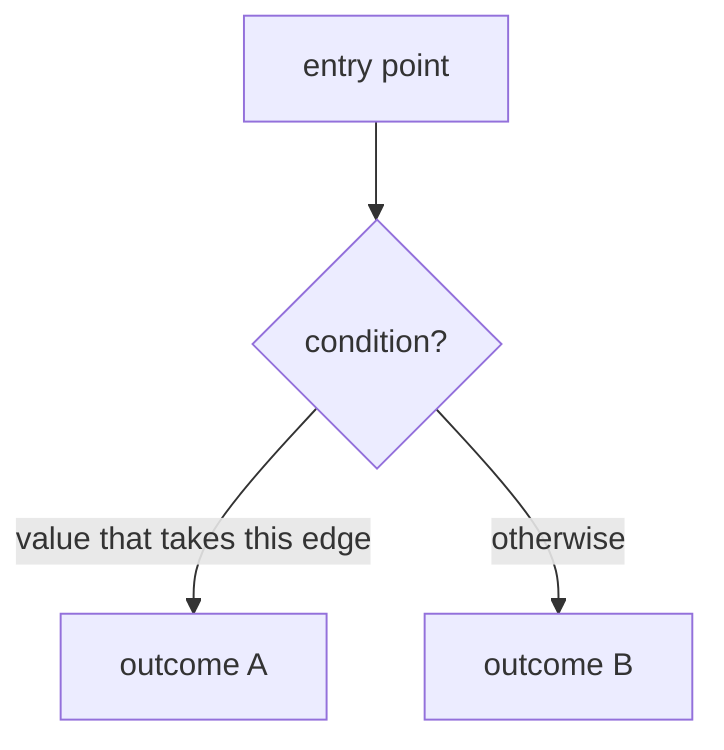
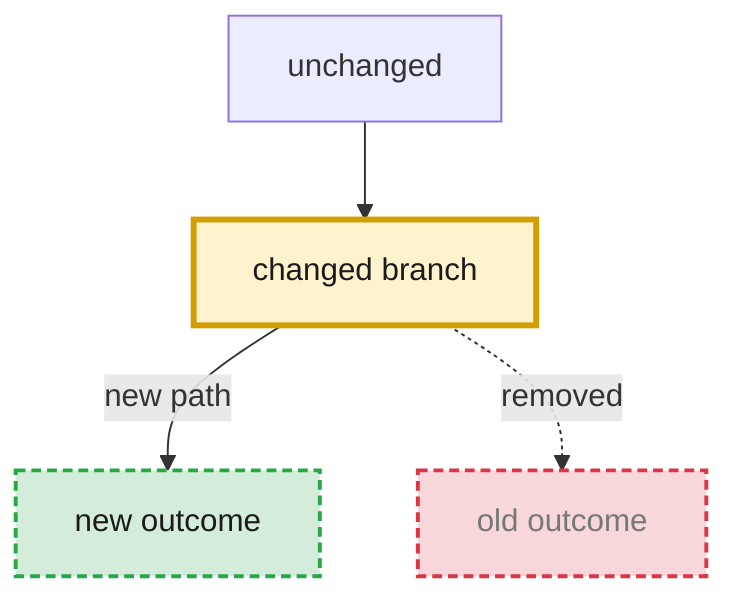
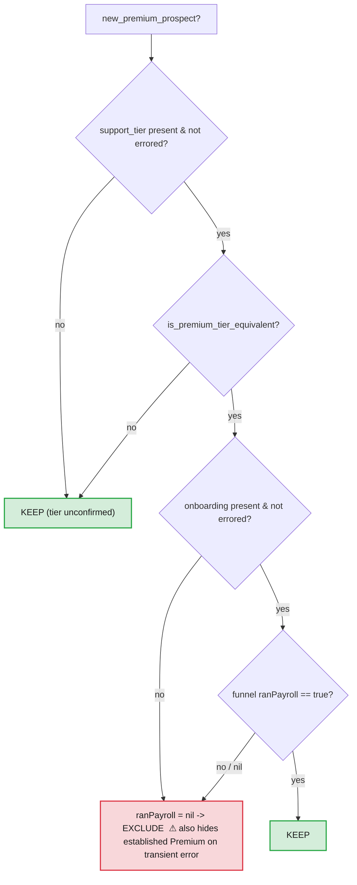

# Mermaid conventions for control-flow charts

These conventions exist so the chart answers the question the user actually has — *"what
happens to this input, and where does it go wrong?"* — not just "what are the boxes."

## Skeleton

Use `flowchart TD` (top-down). Quote node labels in `["..."]` (rectangles) and `{"..."}`
(decisions) so punctuation is safe. **Avoid raw `<`, `>`, `&` in labels** — write words
("Array of Hash") or rely on the preview script's HTML-escaping; raw angle brackets can
confuse rendering on some surfaces.



## Decision-level chart (default; "zoom in")

One method / predicate, every branch traced. Rules:
- Each decision node states the **real condition** from the code (e.g. `support_tier present & not errored?`).
- Each edge is labeled with the **value** that takes it (`yes` / `no` / `nil` / `true`).
- **Terminal nodes are the actual outcomes** in the domain's vocabulary (KEEP / EXCLUDE,
  not `return true`).

## System-level chart ("zoom out")

The call path across methods: caller → service → sub-steps → response. Nodes are
methods/stages and their hand-offs (what type/shape flows along each edge). Do **not** expand
line-level branch logic here — that's what zooming in is for.

## Fail-direction annotations (the high-value part)

For every branch, make the nil / error / missing-data path explicit as its own node — these
are where comprehension breaks. Flag with ⚠ any node that **conflates "unknown" with a real
value** (e.g. an errored fetch falling back to `nil` and being treated as "didn't happen").
That annotation is usually the whole reason the chart is worth drawing.

## Before / after pairs

For refactors / behavior changes, two fenced blocks, each with a one-line heading:

> **Before — <one-line summary>**
> ```mermaid ... ```
> **After — <one-line summary>**
> ```mermaid ... ```

Keep node **IDs stable** across the pair so position holds and the eye tracks what moved.

## Making changes obvious (don't make the reader diff)

Whenever a chart represents a change — before/after, current→proposed, or a refinement of a
prior version — the delta must be *visually obvious*, not something the reader hunts for.

1. **Lead with a one-line caption** above the chart (or the pair): `**What changed:** …`.
2. **Mark the delta with these reusable classes** (define once per diagram, apply with `:::`):



- **added** — green, dashed border (new node/edge).
- **removed** — red, dashed border, muted text (gone in the "after"; show it so the loss is visible).
- **changed** — amber, thick border (same node, different behavior/condition).
3. **Leave everything else in the default style** so the highlighted nodes pop. If three-quarters of
   the chart is colored, the highlight means nothing — only the delta gets a change class.
4. For a **before/after pair**, the *after* chart carries the highlights; the *before* is the plain
   baseline. For a **single refinement**, highlight what moved versus the version it replaces.

## Styling palette

Keep it consistent so colors carry meaning:
- **red** (`fill:#f8d7da,stroke:#dc3545`) — exclude / suppress / risky / ⚠ fail-direction
- **green** (`fill:#d4edda,stroke:#28a745`) — keep / safe / happy path
- **blue** (`fill:#d1ecf1,stroke:#0c5460`) — a returned struct / result / hand-off
- **amber** (`fill:#fff3cd,stroke:#d39e00`) — the key decision node

```mermaid
style RiskNode fill:#f8d7da,stroke:#dc3545,stroke-width:2px,color:#1b1b1b
```

## Worked example (decision-level, with fail-direction ⚠)

`new_premium_prospect?` — Premium + no-first-payroll → exclude; note the nil conflation:



## Preview caveat

The HTML preview loads `mermaid` from a CDN, so it needs internet to render. The saved `.md`
is offline-durable and renders in GitHub/Notion regardless.
